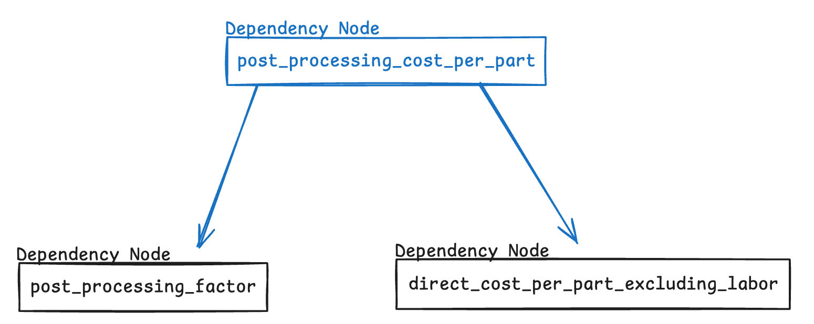
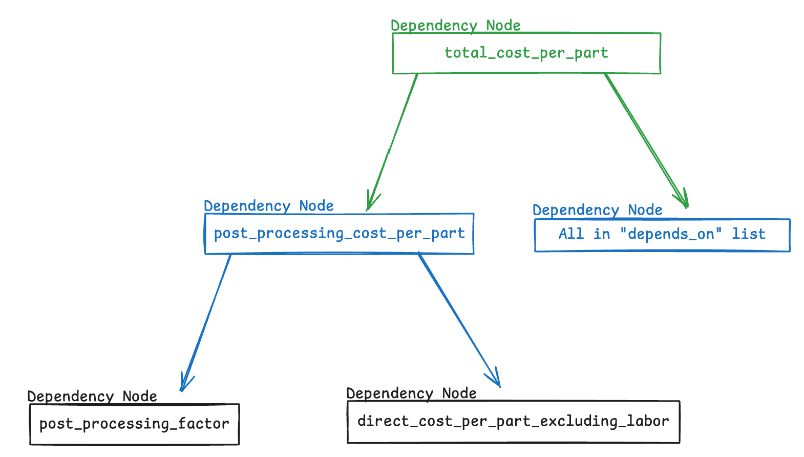
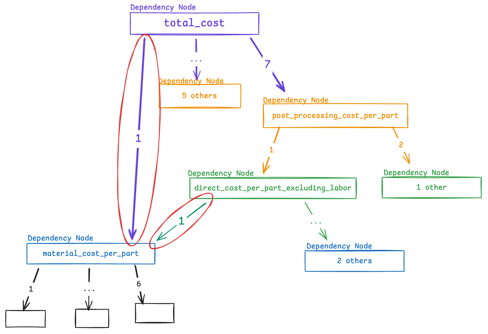

(HowDependencySystemWorks)=
# HowDependencySystemWorks

All examples are pulled from `config/resources/data/definitions/binder_jetting_def.json`

Calculated settings with the json have a "depends_on" attribute. Look at this example

{lineno-start=1 emphasize-lines="10,11,12"}
```json
"post_processing_cost_per_part": {  
  "type": "range",  
  "user_defined": false,  
  "material_dependent": false,  
  "slice_first": true,  
  "decimal": 2,  
  "unit": "$",  
  "description": " = post_processing_factor * direct_cost_per_part_excluding_labor",  
  "formula": "post_processing_factor*direct_cost_per_part_excluding_labor",  
  "depends_on": [  
    "post_processing_factor",  
    "direct_cost_per_part_excluding_labor"  
  ]  
}
```

The "depends_on" list stores names of other settings that `post_processing_cost_per_part` depends on for its calculation. 

When we create a [technology](#TechnologyModel) obj, we first load and create all the settings, then when create a [Setting Dependency Tracker](#SettingDependencyTracker). This tracker will use these "depends_on" lists to create a tree of dependencies. 

So in this example, there will be a Dependency Node(`post_processing_cost_per_part`) that will depend on Node(`post_processing_factor`) and Node(`direct_cost_per_part_excluding_labor`)



---

There may also be situations that a calculated setting depends on other calculated settings. Look at this example

{lineno-start=1 emphasize-lines="10,15"}
```json
"total_cost_per_part": {  
  "type": "range",  
  "user_defined": false,  
  "material_dependent": false,  
  "slice_first": true,  
  "decimal": 2,  
  "unit": "$",  
  "description": " = (material_cost_per_part + machine_cost_per_part + labor_cost_per_part + energy_cost_per_part + post_processing_cost_per_part + maintenance_cost_per_part + total_overhead_cost_per_part)",  
  "formula": "(material_cost_per_part+machine_cost_per_part+labor_cost_per_part+energy_cost_per_part+post_processing_cost_per_part+maintenance_cost_per_part+total_overhead_cost_per_part)",  
  "depends_on": [  
    "material_cost_per_part",  
    "machine_cost_per_part",  
    "labor_cost_per_part",  
    "energy_cost_per_part",  
    "post_processing_cost_per_part",  
    "maintenance_cost_per_part",  
    "total_overhead_cost_per_part"  
  ]  
}
```

The tree for this example looks kinda like this 



And in this case when `total_cost_per_part` is calculated it will first recurse and calculate `post_processing_cost_per_part`. Then calculate all others in "depends_on" list. Then finally calculate itself (`total_cost_per_part`) now that all data is updated. 

This shows it is okay to have calculated settings depend on other calculated settings.

---

There might be a situation where settings at different levels depend on the same setting. 


You can see in this example that `total_cost` and `direct_cost_per_part_excluding_labor` both depend on `material_cost_per_part`. Also notice that `total_cost` indirectly depends on `direct_cost_per_part_excluding_labor`.

This is perfectly fine. This is handled elegantly within the recursive function that does the calculations for each setting. Lets say the recursive algorithm is given `total_cost` to calculate. It will recurse to the lowest level setting and calculate it. That would be `material_cost_per_part`, consider it now calculated. Then itll go back up then go down the `post_processing_cost_per_part` branch, again, going all the way down. While going down, it lands on `material_cost_per_part`, but it already knows that it was calculated before, having stored it in a set right after calculation, so it just returns its currently stored value to be used in `direct_cost_per_part_excluding_labor` calculation. I hope this makes sense.

Long story short. After calculating `material_cost_per_part` the first time, its calculated value will be reused if there is a double dependency like above. 

---

That should cover all there is to know about how the dependency system works. 
To know more about how to setup calculated settings, [read this](#calculated-setting)
