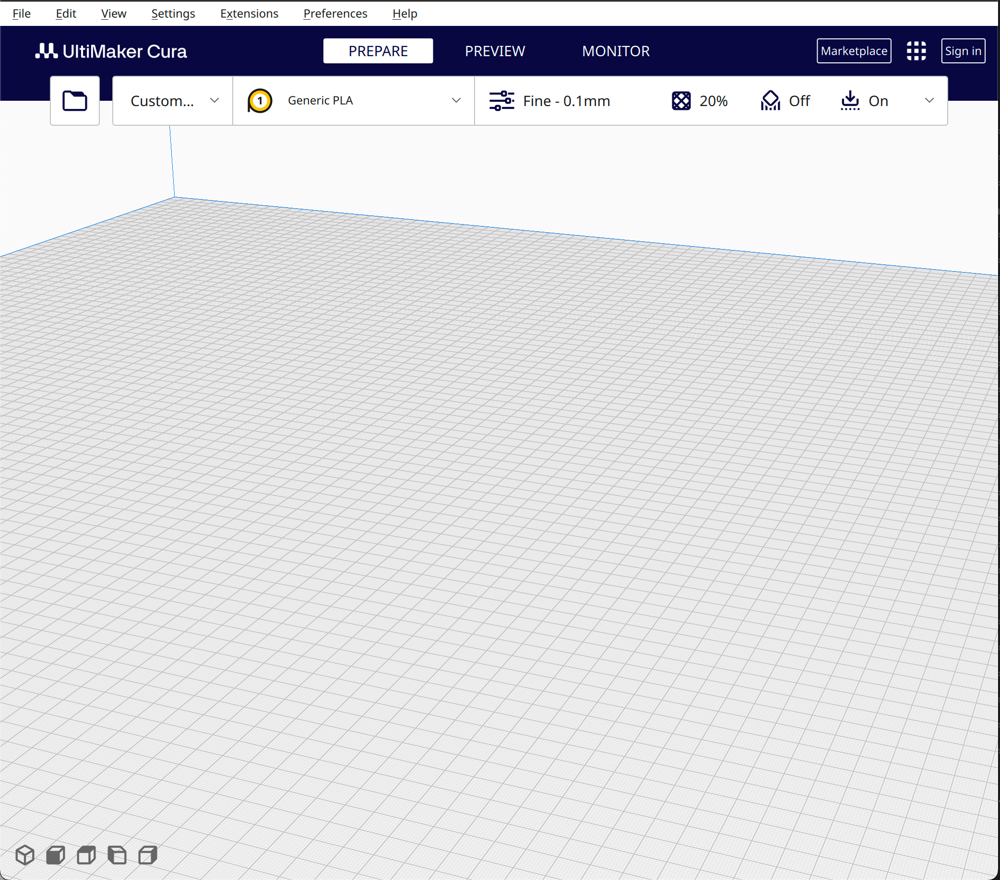
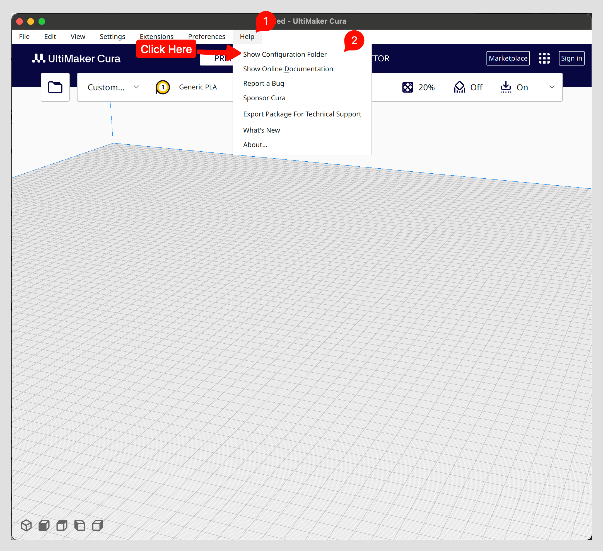
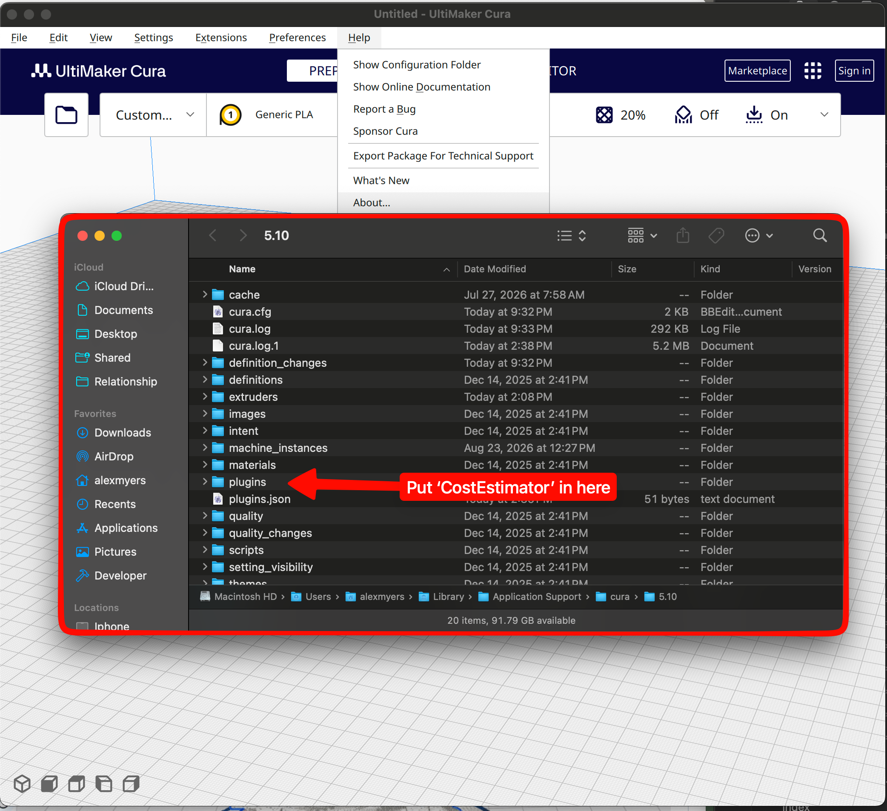
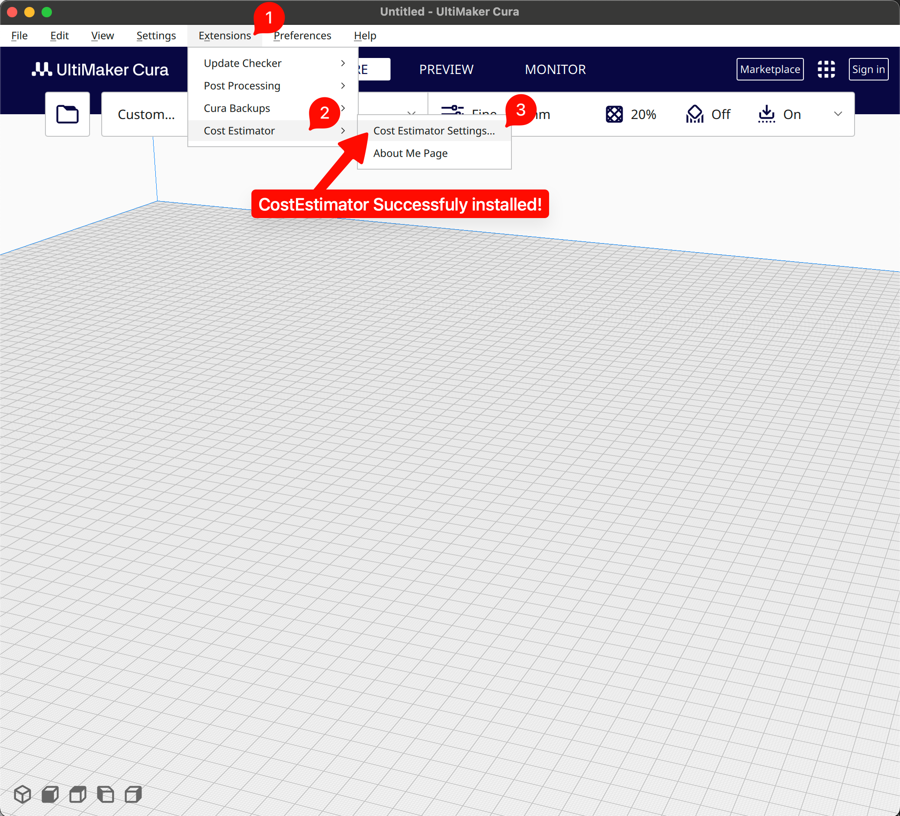

(end-user-install-guide)=
# How to Install Plugin - Guide

1. First download the correct Cura version 5.11.0 here at this link
https://github.com/Ultimaker/Cura/releases#release-5.11.0
To do this open the link, go down to 'Assets' and you should see 'UltiMaker-Cura-5.11.0-win64-X64.msi'. Download that file.

Because its a '.msi' file It may prompt you "Are you sure you want to Download a potentially dangerous file." and you will press 'Continue to install'. This warning is provided for every '.msi' File, download everywhere because it's use to download more files. But because we're downloading from the official Cura GitHub, there's nothing to worry about.

2. Open the 'UltiMaker-Cura-5.11.0-win64-X64.msi' file 
3. When asked for the installation type press on 'typical'.
4. After finishing installation. Press the windows key to prompt a application search and search 'Cura', then launch the program
5. while installing you'll ask you to add a printer. Press on 'non-ultimaker printer.' -> Add a non-networked printer. -> 'Custom' -> 'Custom FFF Printer' -> 'Next'. Then change the printer xyz to be around 1000-3000 mm. This will help you put any size part into Cura. 
6. Continue through until you see this screenshot.

7. Download the CostEstimator plugin from this link
**TODO MUST ADD LINK AND SCREENSHOT GUIDE FOR DOWNLOADING ZIP FROM GITHUB PAGE**
Make sure that the downloaded folder is unzipped and is called 'CostEstimator' and **not** 'CostEstimator-Main' for example. 

8. To add the CostEstimator plugin to Cura, go to 'Help' -> 'Show Configuration Folder'. It should open your File Explorer. Inside you should see a folder called 'plugins'. Copy the 'CostEstimator' downloaded from the previous step into the 'plugins' folder.

9. Restart Cura
10. After launching Cura again, click on 'Extensions' and you should see 'CostEstimator' in the drop down options

Feel free to head on over to the [end user documentation](#end-user-usage-docs) to learn how to use the plugin!
