(end-user-usage-docs)=
# Plugin Usage Guide

1. Ensure that the Cost Estimator plugin is installed in Cura's plugins folder, then open Cura.
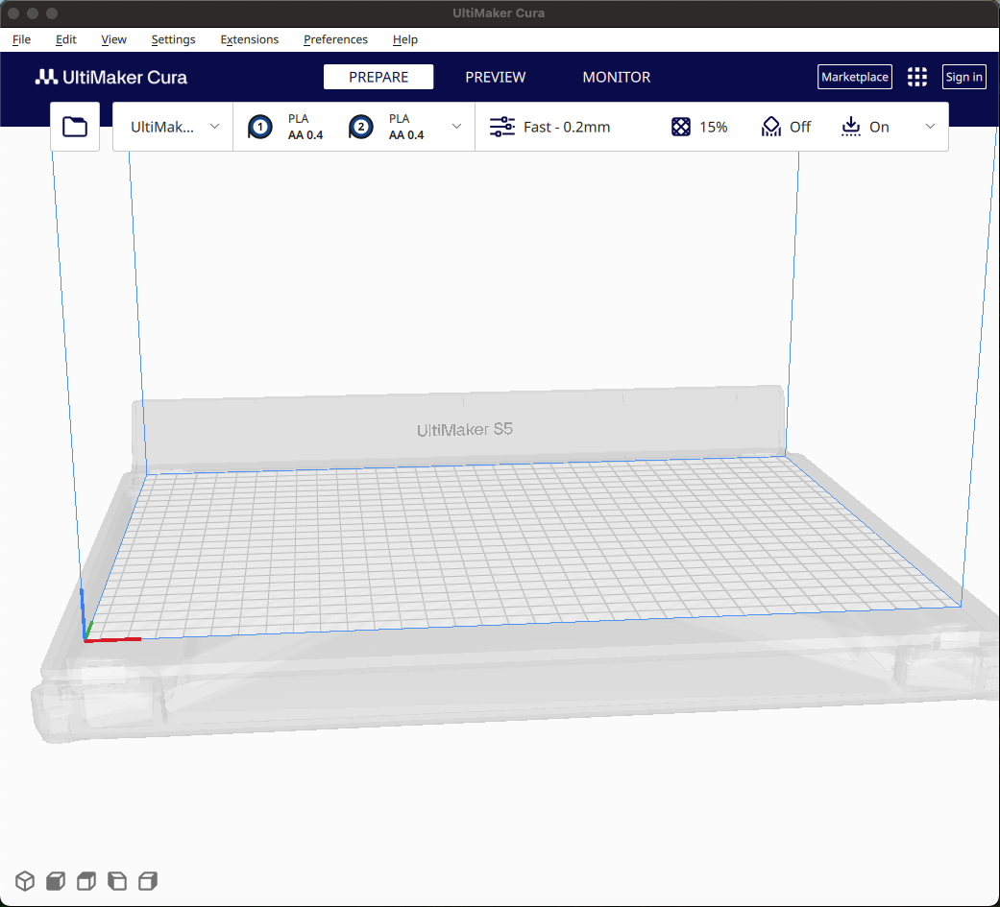

2. Click the file icon in the upper-left corner to select the desired '.stl' part file from your computer.
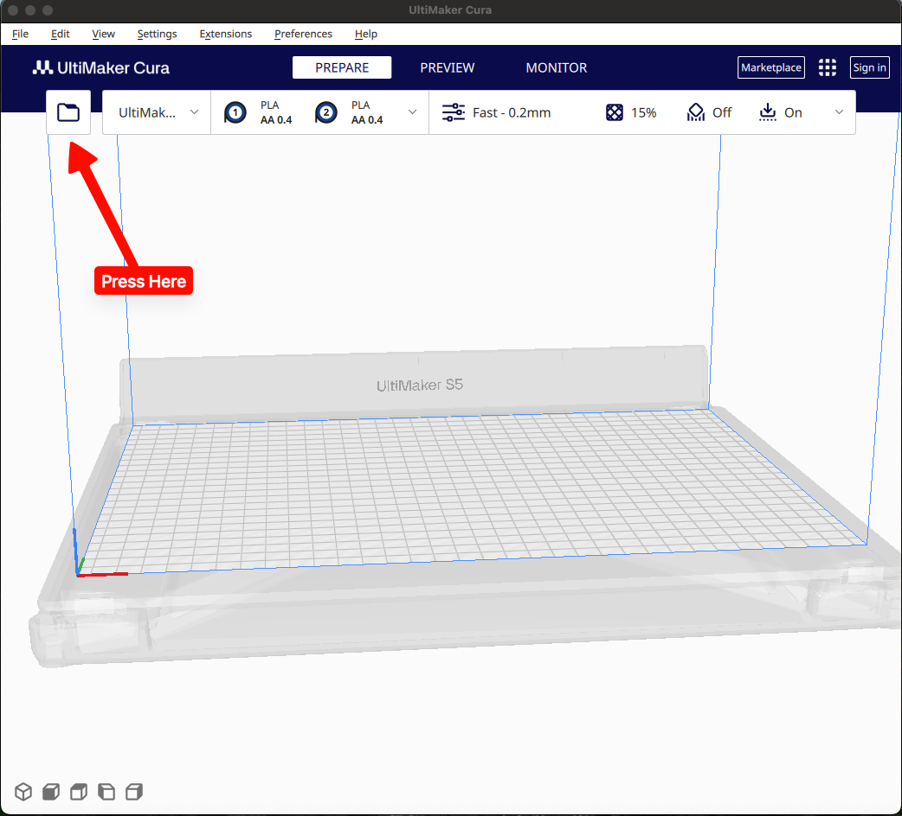

3. Once the part has loaded, it should appear on the Cura print bed.

4. If an error appears indicating that the part is too large, follow steps 4a–4b before proceeding to step 5.

4a. If a warning appears indicating that the part is too large, navigate to 'Preferences' → 'Configure Cura…' → 'Printers' → 'Add New' → UltiMaker printer → 'Add local printer' → 'Add a non-networked printer' → 'Custom' → 'Custom FFF Printer' → 'Add.' Then, under 'Machine Settings,' increase the X, Y, and Z dimensions to sufficiently large values to ensure the part fits.

4b. **Delete the part** and re-add it to clear the error. Otherwise, the plugin will be unable to perform calculations later in the process.

5. At the top of the screen, select 'Extensions' → 'Cost Estimator' → 'Cost Estimator Settings…'
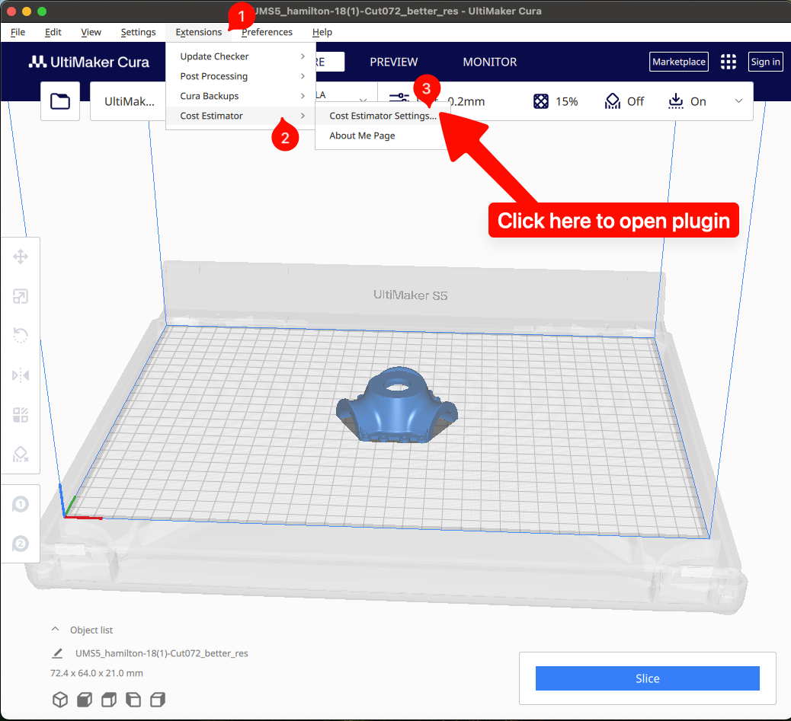

If 'Cost Estimator' does not appear under 'Extensions,' the plugin has not been installed correctly. First, confirm that you are running Cura version 5.10.4–5.11. Next, verify that the 'CostEstimator' folder is present within Cura's plugin directory and contains files. If both conditions are met and the issue persists, consult the installation instructions provided with the plugin files to determine whether a step was missed.

## Configuration Panel

6. Upon opening the plugin, the Configuration Panel is displayed.
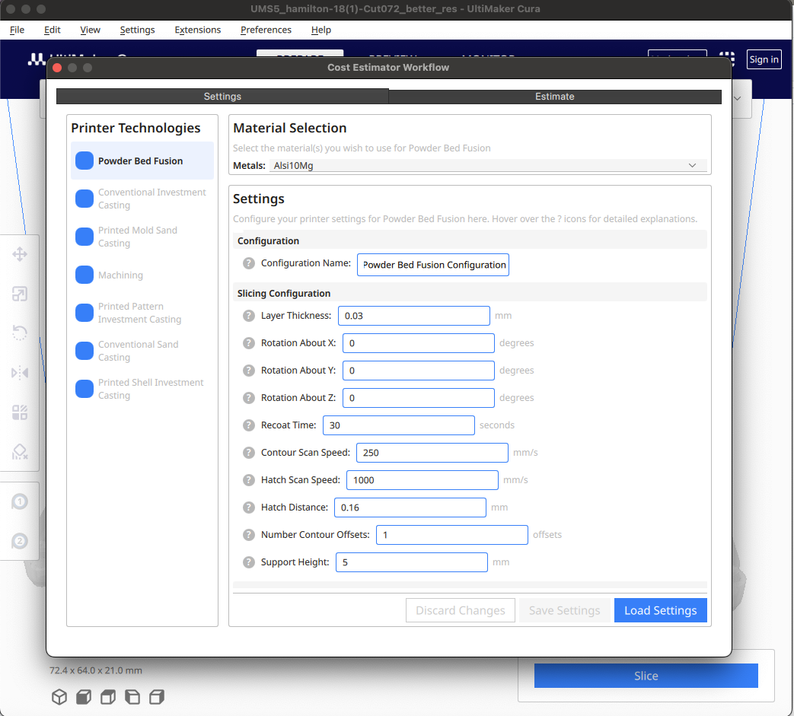

7. The technology picker is located on the left side of the panel. Select the technology for which you would like to generate a price estimate.
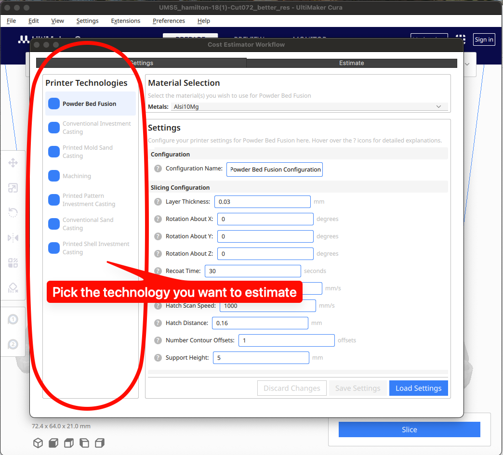

8. The 'Material Selection' area is located at the top of the panel. Select the material to be used for the estimate.
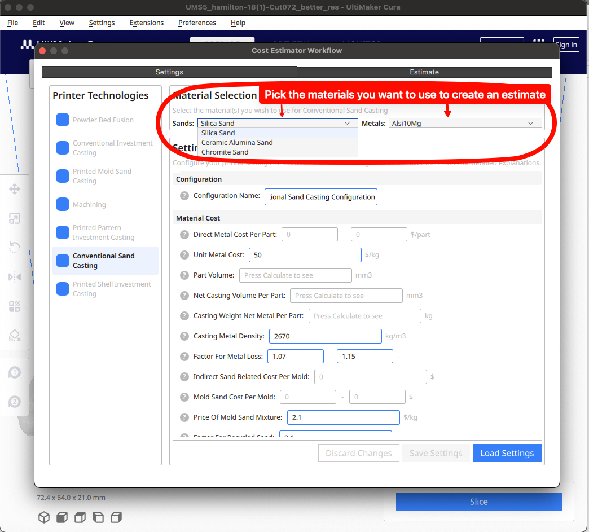

9. Review the configurable settings listed in the center of the panel. Settings displayed in grey are non-editable and include calculated values and part properties. You may wish to adjust certain user-editable settings to improve the accuracy of your estimate. For example, changing the batch size to reflect the number of parts you intend to produce will update both the 'Cost per Part' and 'Production Volume' values. If using a furnace-based technology, you may want to adjust the 'Furnace Acquisition Cost' range. Similarly, if your 'Technician Hourly Rate' differs from the default range of $30–35, you may wish to update it to obtain a more accurate estimate. When modifying a range, adjust the maximum value before the minimum value, as the minimum cannot be set higher than the current maximum.

Additional settings may be modified depending on your familiarity with the process. Each setting includes a tooltip providing further information; to view a tooltip, hover over the grey question mark icon adjacent to the setting. 
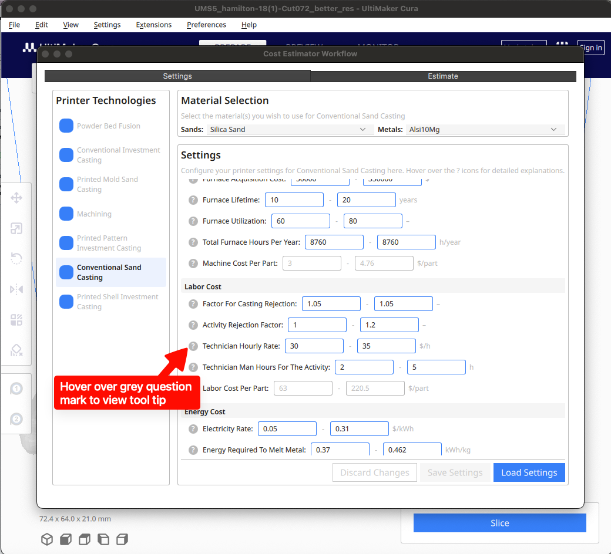

While settings are being modified, a small yellow 'Modified' label will appear near the top of the scroll panel, and the 'Discard' and 'Save Settings' buttons will become active. You may switch between technologies without losing your modifications. However, if you wish to close the plugin while retaining a copy of your modified settings, select 'Save Settings' at the bottom of the panel. For additional information, refer to the 'User Saved Settings' section near the end of this document.

If you attempt to close the plugin with unsaved changes, you will be prompted to confirm whether you wish to discard them. Selecting 'Discard' will remove all settings modified during that session, including those associated with technologies other than the one currently selected.
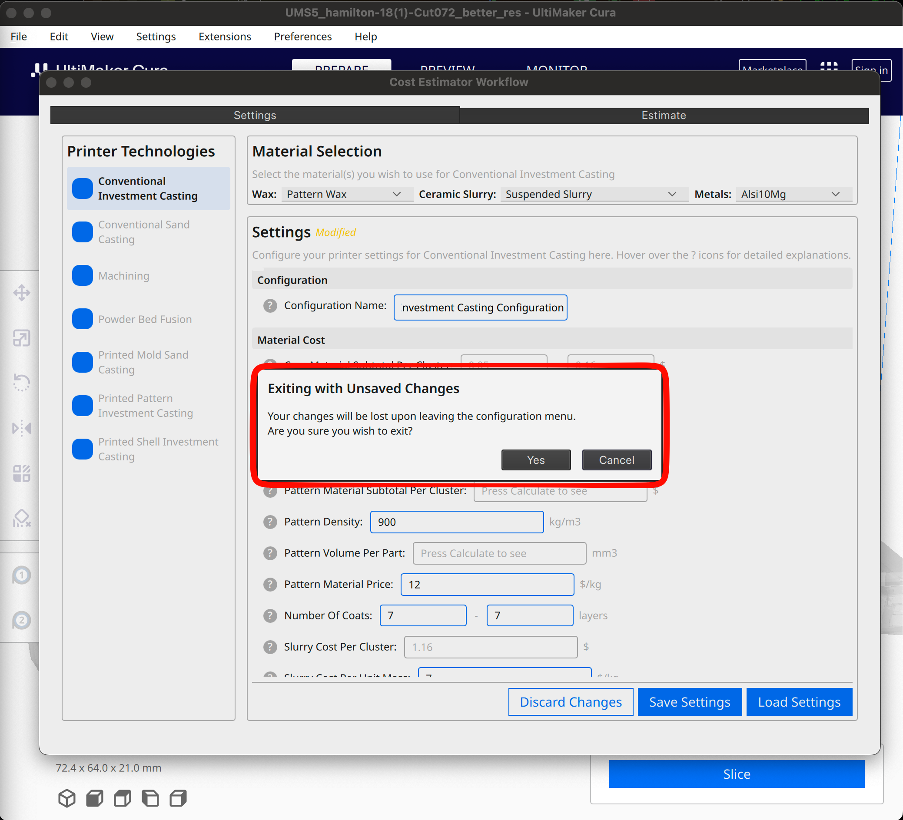

## Estimate Tab 

10. After configuring the desired settings, select the 'Estimate' tab.
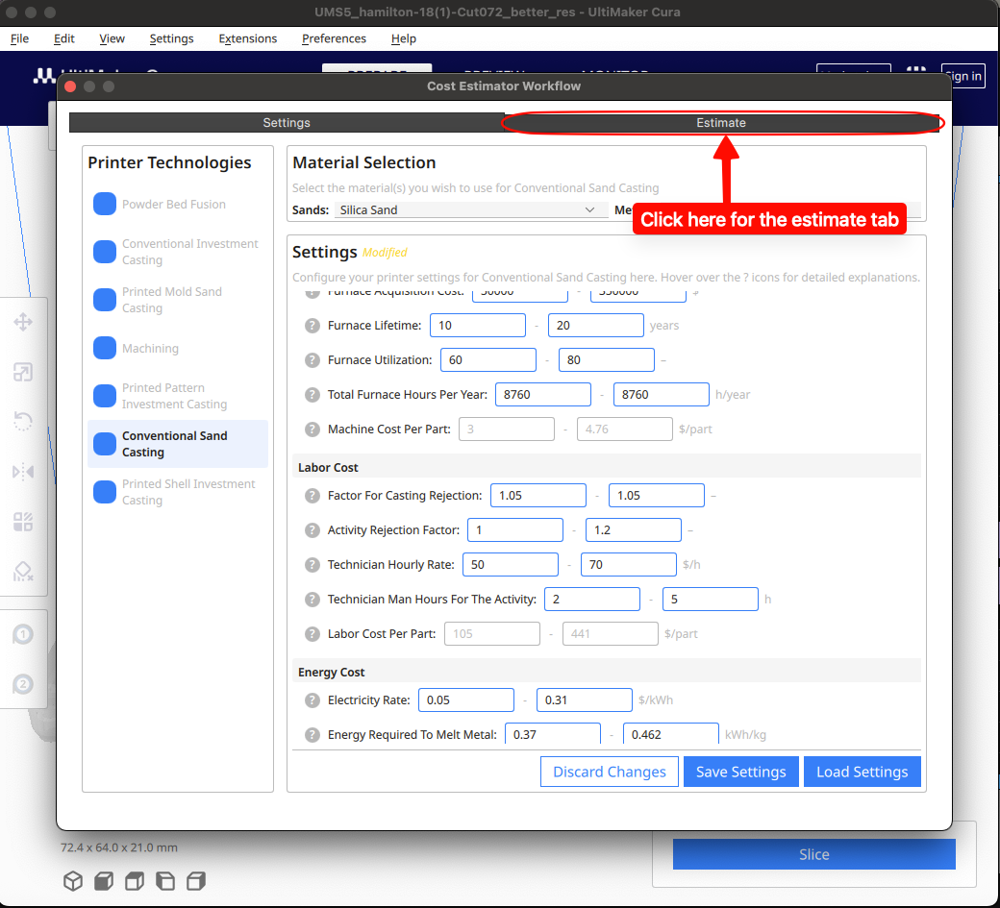

11. A new window will appear containing blank information fields. Depending on the selected technology, a 'Layer Slicing' option may be available. Layer Slicing estimates are supported only for 'Powder Bed Fusion,' 'Printed Mold Sand Casting,' and 'Printed Pattern Investment Casting.' 
Layer slicing provides a more accurate print time estimate because it calculates how long it will take each individual layer. There is a trade off in the amount of calculation time it takes the plugin when this option is selected. For example LBPF will take longer for the plugin to finish estimating because it will create layers at minimum 0.03 which somethings results to tens of thousands layers, taking longer to calculate. 
Quick calculation will use how tall the part is and how many layers it has then it applies a default layer print time to each layer. 

Note that the Cost Estimator plugin does not use Cura's 'Slice' function; slicing the part in Cura is not required to obtain a cost estimate. Only the 'Calculate' button within the Estimate tab needs to be selected.
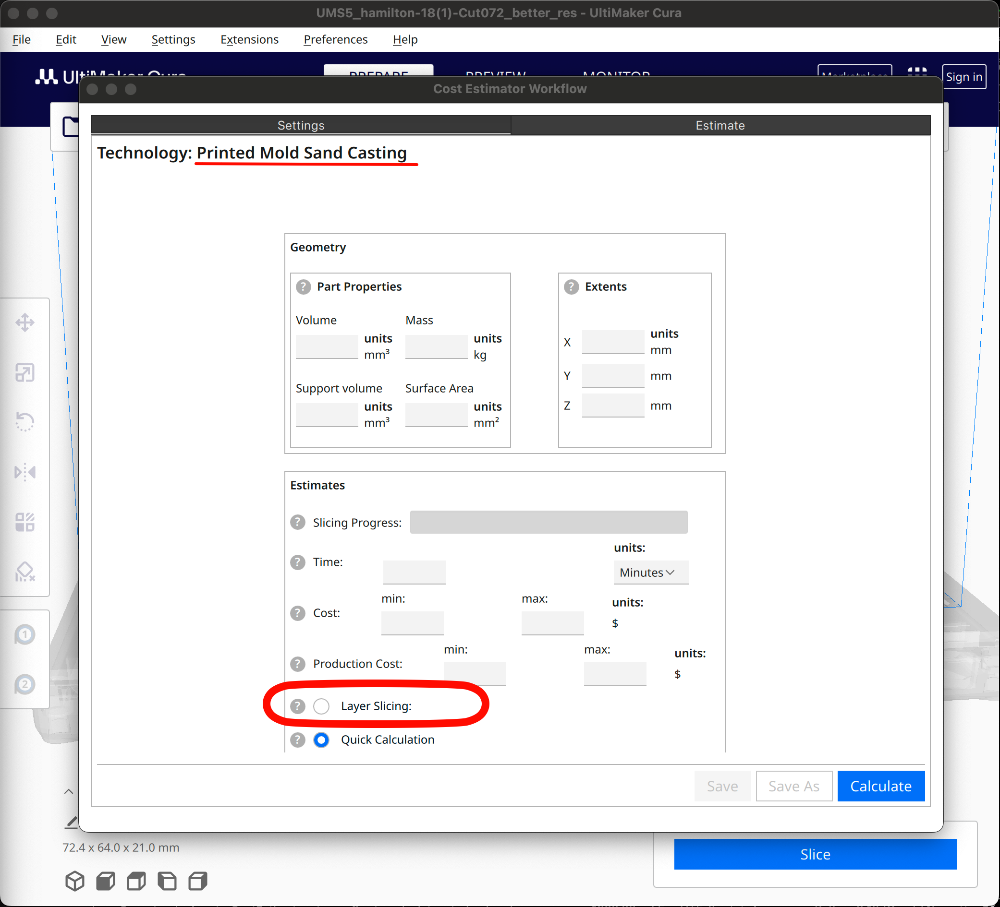

12. When ready, select the 'Calculate' button in the bottom-right corner to generate an estimate for the part. The 'Calculate' function generates estimates based on the most recently selected technology from the Configuration Panel, which is also displayed at the top of the Estimate tab.
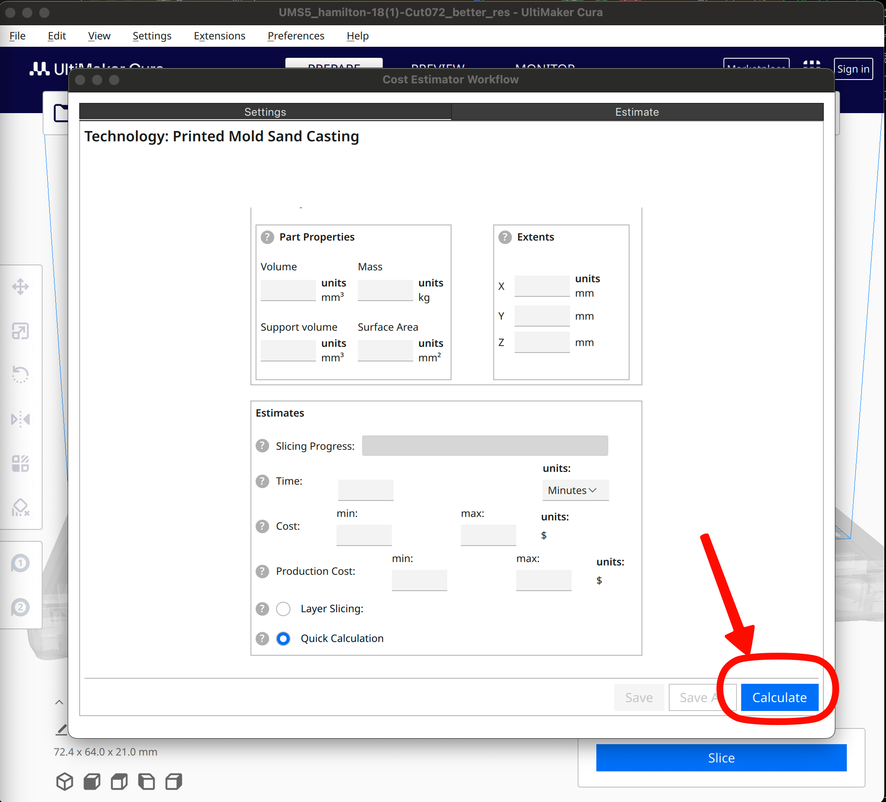

13. A warning may appear if the estimated part cost is below $300, noting that some manufacturers require a minimum order value or minimum batch size.
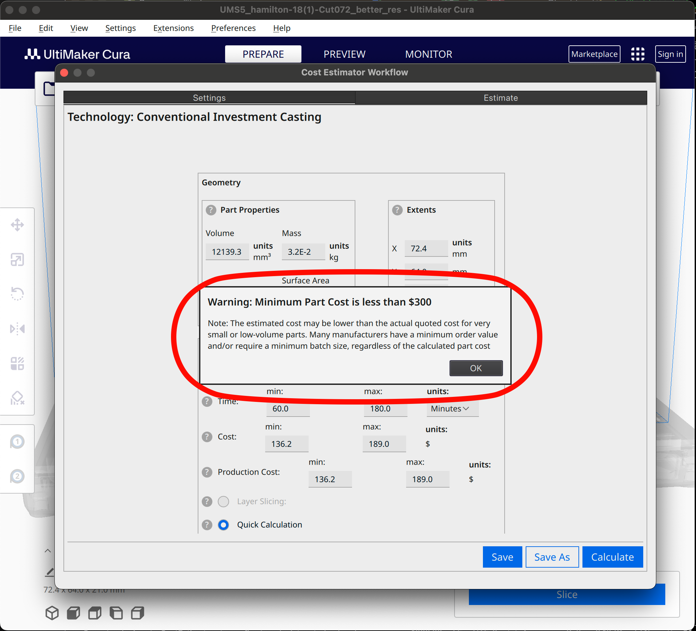

14. Once the calculation is complete, the results will be displayed in full. 
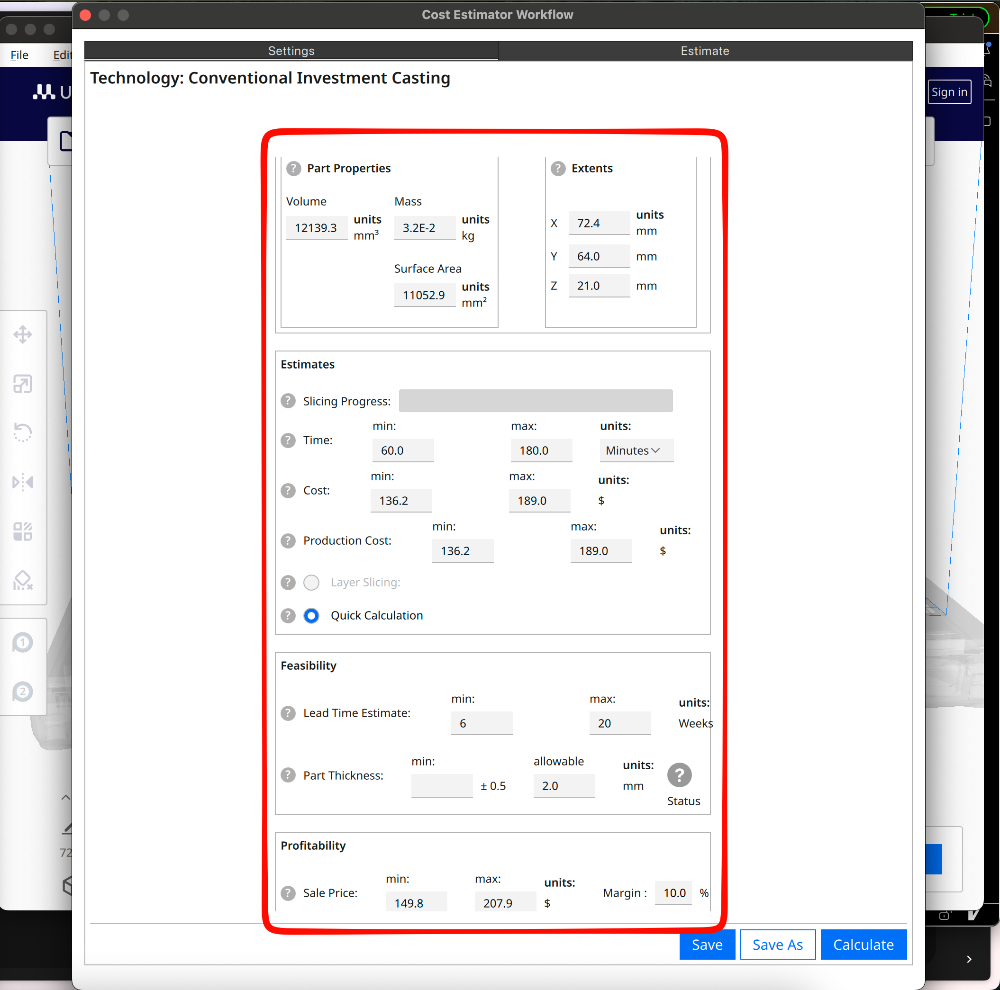
The Part Properties section displays the part's volume, mass, and surface area. The Extents section displays the bounding box dimensions. The Estimates section displays the estimated production time in either minutes or hours, selectable via a toggle. The Cost Estimate section displays the minimum and maximum estimated cost. If the 'Batch Size' has been modified, the 'Production Cost' will differ from the standard cost.

Note that the 'Production Cost' calculation incorporates expected volume discounts. No discount is applied for a batch size of 50 or fewer units. A 10% discount is applied for batch sizes between 51 and 100 units, inclusive. A 15% discount is applied for batch sizes exceeding 100 units.

The Feasibility section includes a 'Lead Time Estimate,' which indicates the expected lead time for the selected technology prior to receiving a manufacturer quote, and 'Part Thickness,' which displays the minimum wall thickness detected in the part relative to the minimum allowable thickness of 2 mm. Refer to the corresponding tooltip (grey question mark icon) for additional detail.

The Profitability section displays the sale price per part, calculated by applying the specified 'Margin' percentage to the part cost. To change this Margin, you click inside the box, change the number, then press ‘Calculate’ again. This is a different functionality compared to the configuration panel. 

## Comparing Estimates

15. This tool is designed to facilitate comparison between different additive manufacturing technologies. After calculating an estimate, use the 'Save' or 'Save As' buttons in the bottom-right corner to record your results.
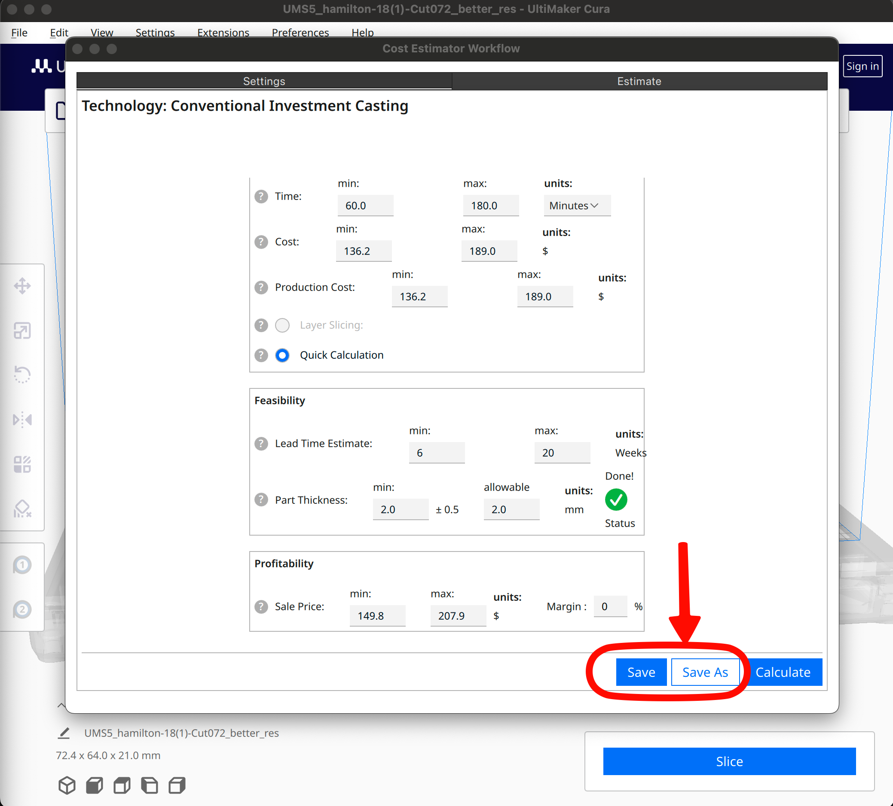

Select 'Save' to save the results to your Downloads folder as an Excel spreadsheet. For greater control over the file's name, location, and format, select 'Save As.'
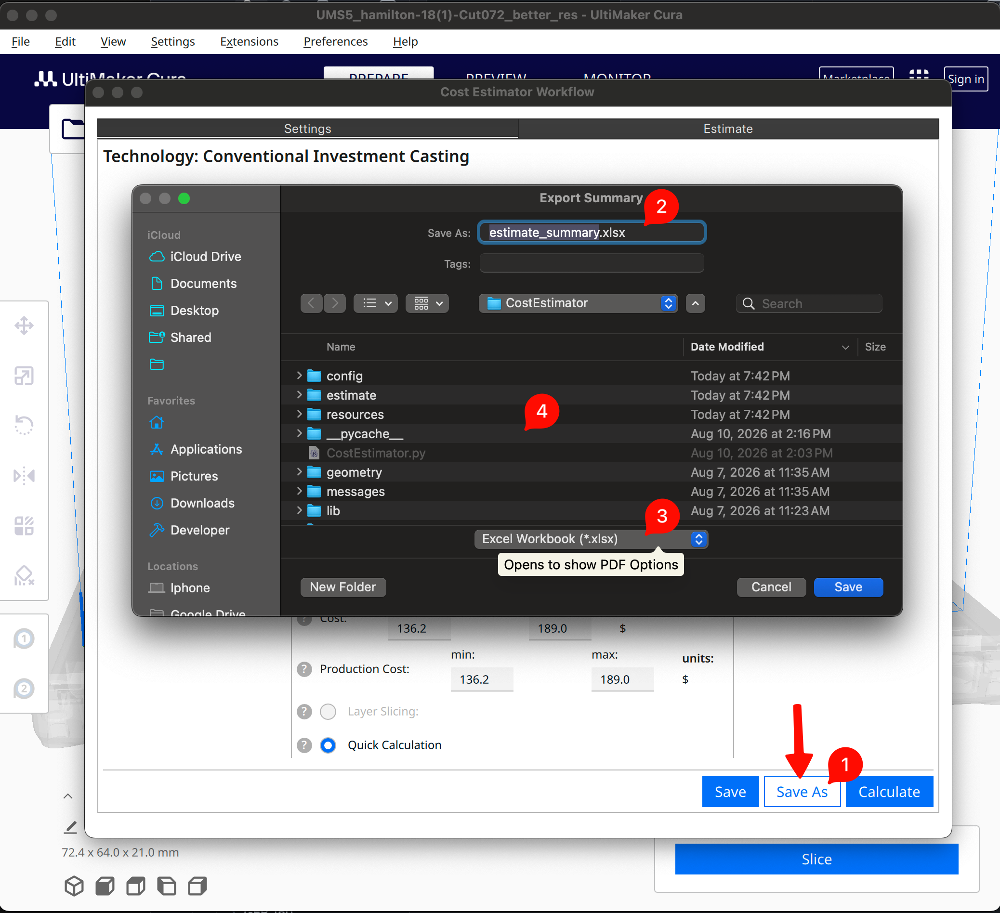

Selecting option 1 (indicated by the red circle) opens a file explorer window, allowing you to specify the file's location and type. Option 2 allows you to rename the file as desired. Option 3 provides a dropdown menu containing a 'PDF' option, which appends the estimated results to a PDF file; alternatively, the Excel Workbook format may be retained to append the results to an existing spreadsheet. Option 4 allows you to select any save location.

After the initial save, you may return to the Configuration Panel, select a different technology, modify any desired settings, return to the Estimate panel, and calculate a new estimate. Selecting 'Save' at this point will append the new results to the previously saved file, regardless of whether it is a PDF or Excel file. The plugin retains the file destination even if the plugin or the Cura application has been closed in the interim, for the user's convenience.

The following are examples of saved estimate results in both PDF and Excel formats.

**Excel**
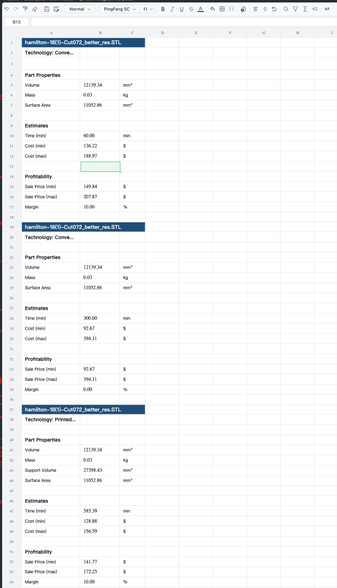

**PDF** (two pages combined for a reduced screenshot size)
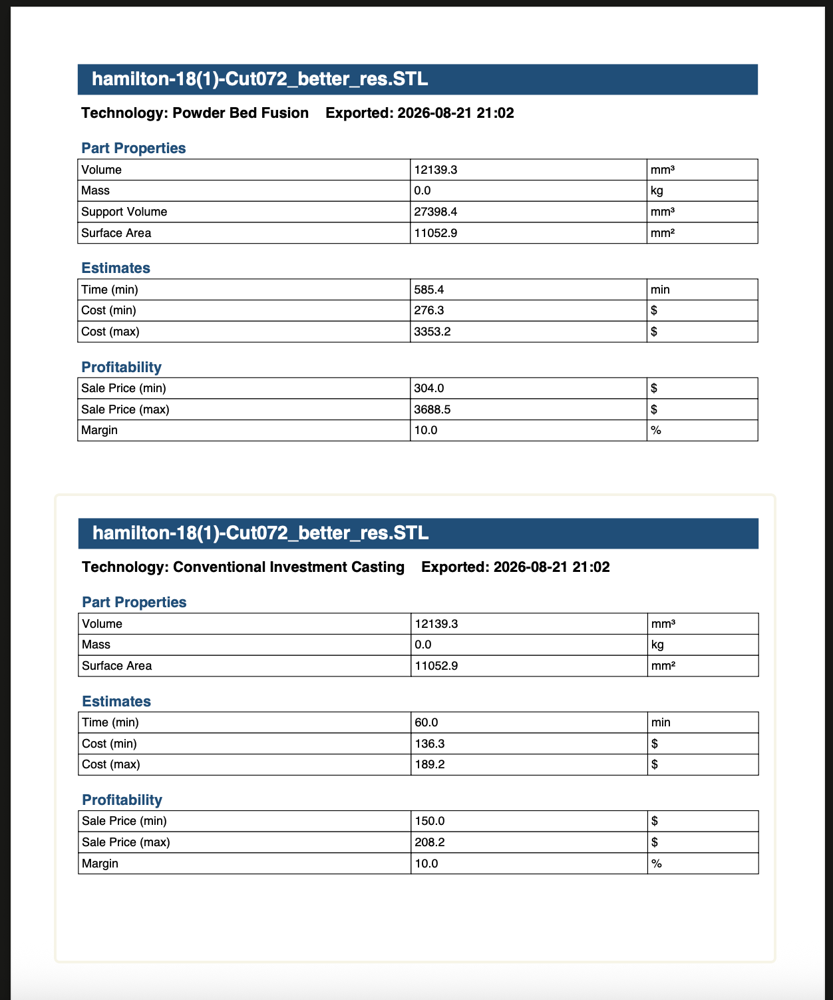

From this point, you may proceed to load additional parts, apply different technologies, and adjust user-editable settings as needed.

## User Saved Settings
When settings are modified within the Configuration Panel, a small yellow 'Modified' label appears near the top of the Settings panel, and the 'Discard' and 'Save Settings' buttons become active.
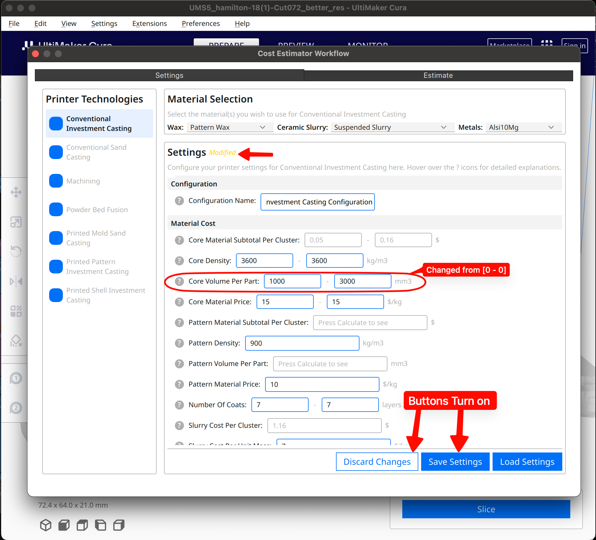

Once settings have been modified, select 'Save Settings' to save the configuration as a '.json' file to your hard disk. Selecting 'Save Settings' opens a file explorer window, allowing you to choose the file's save location. The default location is the plugin's 'CostEstimator/config/resources/data/user' folder; an alternate location may be selected if preferred.
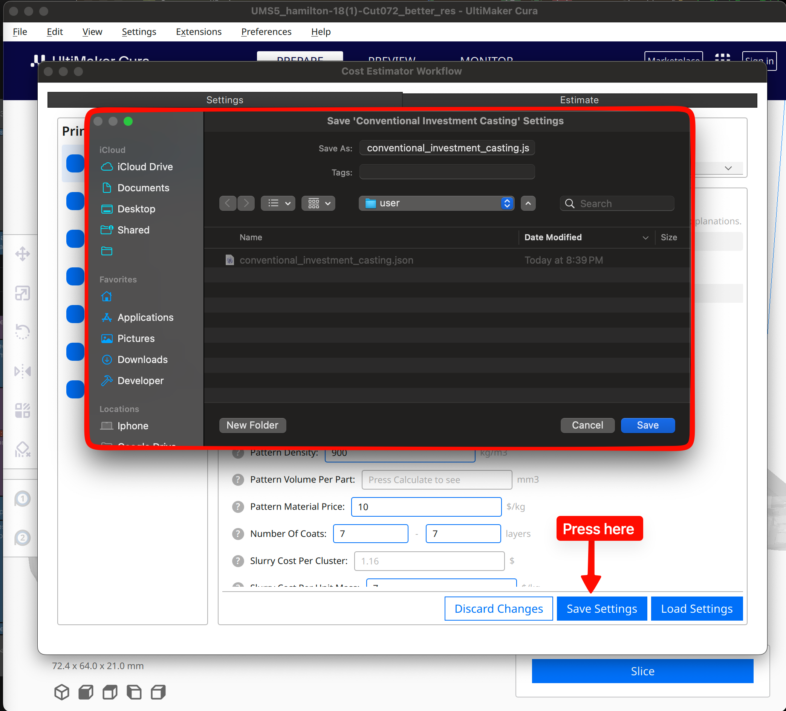

Saved settings remain in effect until the Cura application is closed and reopened, at which point the plugin will revert to its default settings. To restore your saved settings, select 'Load Settings.'

Because each setting is governed by specific validation rules, and the saved settings file must conform to the required '.json' format, the file should not be modified manually, as doing so will prevent it from loading correctly. To make changes to a saved settings file, select 'Load Settings,' make the desired adjustments within the plugin, and save the file again.
