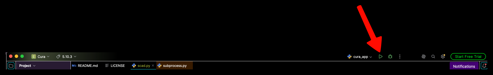
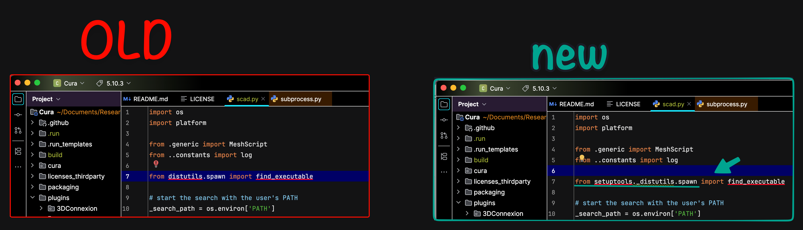

# Getting Started

It is recommended for development work to compile the Cura source code and work directly within Cura. This will allow most LSPs to capture Cura's API and the source code can be used as a direct reference to Cura's API.

(getting-started-cura-source)=
## Cura Source Installation

I am using a mac for development. Here are the commands I ran to get the source code loaded onto my computer with all dependencies installed and PyCharm setup to allow me to develop this plugin. **If you are working on windows** then there are alternatives to some commands, and these are found [here](https://github.com/Ultimaker/Cura/wiki/Running-Cura-from-Source) where I got the commands in the first place. 

Run these anywhere on your pc:
1. python -m venv cura_venv 
2. source cura_venv/bin/activate 
3. pip install -r [https://raw.githubusercontent.com/Ultimaker/cura-workflows/main/.github/workflows/requirements-runner.txt](https://raw.githubusercontent.com/Ultimaker/cura-workflows/main/.github/workflows/requirements-runner.txt) 
4. conan config install [https://github.com/ultimaker/conan-config.git](https://github.com/ultimaker/conan-config.git) 

Then I created a `~/Documents/Reserach/Cura-Root` folder, then `cd Cura-Root` to run the following commands. 
1. conan profile detect --force git clone [https://github.com/Ultimaker/Cura.git](https://github.com/Ultimaker/Cura.git) 
2. cd Cura
3. git checkout tags/5.10.3 
4. conan install . --build=missing --update -g PyCharmRunEnv # notice the switch to PyCharmRunEnv source 
5. build/generators/virtual_python_env.sh 

Then I opened PyCharm, Open Project, Select `/Cura-Root/Cura` folder.
Remember `/Cura-Root` is my own folder I created to house the Cura repo. 

Then I pressed the little play button in the top right

Then Scrolling through the log I see a error with the "Trimesh Reader" module. It gave me the error `ModuleNotFoundError: No module named 'distutils'`. Then to give you a little insight, distutils was not included with python installs from version 3.12 onwards, so im thinking that for this Cura version 5.10.3 it was during a time before version 3.12. So to fix this I found that distutils is installed now under `Setuptools` package. So we must change a line of code inside this file 
`~/Documents/Research/CADCAST_Research_Assistant/Cura-Root/Cura/build/generators/cura_venv/lib/python3.12/site-packages/trimesh/interfaces/scad.py`

Then running it again, everything seems to be working. Although small note as of July27,2026 there is a problem with macs and **rtree** and **embreex** packages. Im working on figuring out why as im writing this. 

---

## OLD NOTES BELOW THIS HEADER

The source code for Cura needs to be downloaded and compiled for your system. The instructions to do so can be found on [Cura's Running from Source Docs](https://github.com/Ultimaker/Cura/wiki/Running-Cura-from-Source). 

I started by using VSCode which would require me to launch cura from terminal. But **now I did the few commands to get PyCharm working instead because it allows you to press the "Run" button and it launches Cura, its so much faster.**  You can find out how [here](https://github.com/Ultimaker/Cura/wiki/Getting-Started#developing-cura)

While it may be highly recommended you read through the entire GitHub Wiki as it can highlight some troubleshooting issues when attempting to install from source or install for your specific IDE, that takes to long, and I wouldnt do it personally. Here are my notes for installing on mac below to save you some time.

**MAKE SURE YOU ARE ON CURA VERSION 5.10.3** ‼️❗❗
### My instal experience with Mac
Notes:
- Make sure you get cura 5.10 (not 5.10.0)
	- This means clone the entire Cura repo, then do `git checkout tags/5.10.3` 
- I found when you clone cura it will create a directory inside the current directory. So I created my own "Cura-Root" in my Research folder, then went in there to clone it. It then created a "Cura" source code folder
- In Step 4. in the wiki I don't remember every running those commands in the 'Note on the execution virtual enviorment'
- I used the PyCharm method so I ran the command `conan install . --build=missing --update -g VirtualPythonEnv` Then when you launch PyCharm it should have a 'Project Default' interpreter already set
- Inside `Cura-Root/Cura/build/generators/cura_venv/lib/python3.12/site-packages/trimesh/interfaces/scad.py` I changed the line `from distutils.spawn import find_executable` to be `from setuptools._distutils.spawn import find_executable` because distutils was now apart of setup tools
- After doing Step 3. on the wiki `conan install` you should be able to just do the steps below. And from now on, you should only have to do the steps below
1. `source build/generators/conanrun.sh`
2. `source cura_run_venv/bin/activate` 
3. `conda deactivate` (NOT REQUIRED ACTUALLY)
4. `python cura_app.py`

---

(getting-started-cura-standard)=
## Cura Standard Installation
to be done later 