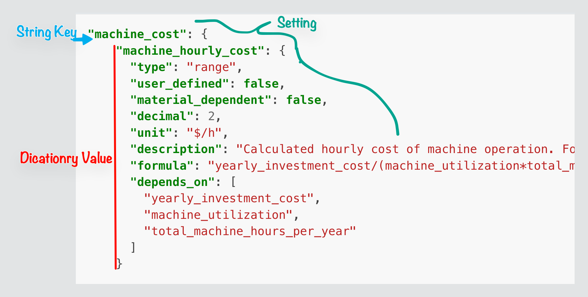

(JsonDefinitions)=
# Json Definitions

:::{note}
When "setting" is mentioned it refers to the definition json key value pairs of 
the example below. This key:value is inside a "category". An example of a category is "material_cost" or "energy_cost" within machining_def.json. A setting in this case would be a key:value pairing within the "material_cost" category values. An example of a setting is shown below. 

{#init-setting-json-def-example}
`CostEstimator/config/resources/data/definitions/machining_def.json`

:::
Here above is an example of a json definition for reference.
This is a reference of a **calculated** setting. This is because it has both a `"formula"`, and `"depends_on"`


## There are a few different types of settings that are modeled in the json.
{#user-defined-setting}
**User-defined setting**
- A setting is *user-defined* if it has the attribute `"user_defined": true` 
- It is required for all user defined settings to have a "min" / "max" attribute to make sure the user does not pass in a value that has a integer overflow. Make sure the types of the "min" / "max" are the same. 
- If a setting needs decimal accuracy (e.g. 10.0348) for the user input, then make sure to include the "decimal" attribute so that the user can input more decimals. [How to use decimal attribute](#how-to-use-decimal-attr)

{#material-dependent-setting}
**Material Dependent Setting**
- This is a sub-category of [User-defined Setting](#user-defined-setting).
- A material dependent setting is a setting that will have different values depending on what physical additive material is being used for this addictive manufacturing technology. 
:::{admonition} Click to see Material Dependent Example
:class: dropdown

{lineno-start=1 emphasize-lines="4,10,11,12,13,14"}
```json
"specific_energy_to_melt_metal": {
      "type": "range",
      "user_defined": true,
      "material_dependent": true,
      "min": 0.0001,
      "max": 10000.0,
      "decimal": 4,
      "unit": "kWh/kg",
      "description": "The amount of energy required to melt specific types of metal materials measured in kilowatt-hours per kilogram of metal.",
      "materials": [
        "alsi10mg",
        "alsi7mg0.6",
        "316_l_stainless_steel",
        "in625"
      ]
    }
// CostEstimator/config/resources/data/definitions/binder_jetting_def.json
```
:::
- You will see in the example above that it is Material Dependent. It will have a different value for each material. This makes sense because the setting is called "specific_energy_to_melt_metal" which should change per material. 
- Every *Material Dependent Setting* must have `"material_dependent": true` and have `"materials": [listOfMaterialNames]` set 
- The "materials" attribute must **only** have material names that can be found in `"metadata": "compatible_materials" : "anySubCategory"` or else the validator will not allow the plugin to launch. Look below in [How to use materials attribute](#how-to-use-materials-attr).
- The "materials" list attribute **MUST** have **EVERY** material within a material group (defined in the metadata). This means for the example above, if the setting defines a value for "in625" then it **MUST** define a value for all of the other materials in that material group, ("alsi10mg", "alsi7mg0.6", "316_l_stainless_steel" for this example, but if might be different ones if its a different material group)
- Make sure you set the [Json Defaults](#JsonDefaults) appropriately for material dependent settings. You can see how to in the Json defaults page under the [Material Dependent Settings](#setting-material-dependent-default).

{#calculated-setting}
**Calculated Setting**
- A setting is *calculated* if it has the attributes `"formula"` and `"depends_on"` in its definition
- A calculated setting should never have a "min" / "max" attribute because we do not want to limit the calculated value to a range
- The `"formula"` attribute is needed so that hopefully in the future we can redesign the calculator module to parse this formula into a reverse polish notation and use a stack to first verify the formula is valid in the validation stage, and then in the calculation of the setting it can parse the formula string and calculate the setting without a coded definition for it. 
- The `"depends_on"` attribute is needed because in a process the [user defined setting](#user-defined-setting) is updated by the user, it will use the [dependency tracker](#SettingDependencyTracker) to recursively backtrack and update all settings that are affected by that new value. Check below [how to use the depends on attribute](#how-to-use-depends-on-attr)
:::{seealso}
Look at the [calculation](#Calculator) module, you will see that *every* setting has its own update/calculate function which is extremely tedious and we would love to not have it this way.
:::

{#stl-input-setting}
**STL Input setting** 
- A setting is a *STL Input Setting* if it has "STL Input" or "Build Time Estimation" in the `"description"` attribute **and** if it has `"slice_first": true` in its definition. 
- These settings are **not** to be confused with [calculated settings](#calculated-setting) that have `"slice_first": true`. The difference is that a *STL Input Setting* will be updated using the [configAPI](#ConfigAPI) function `input_STL_data(tech_type, new_stl_input_data)`{l=python}. Versus [calculated settings](#calculated-setting) which are recursively updated using the new values after the new input data is inputed. 
- These settings must be filled in by the [Estimator](#Estimator) module after the user presses the lower right button in the Estimator tab of the plugin. 
- These settings have special traits of always having their "original value" being overwritten. This only makes sense if you read the [Setting Model](#SettingModel) documentation. 


## How to use each attribute 
{#how-to-use-name-attr}
**"name"**
- Anything that describes the setting briefly. 
- Convention is all lowercase with underscores -- snake case
- Keep in mind this name will be used in so many places.
	- [depends_on](#how-to-use-depends-on-attr)
	- [formula](#how-to-use-formula-attr)
{#how-to-use-type-attr}
**"type"**
- This is limited to a few strings "int" "float" "string" "range" "boolean" and these are enforced by CostEstimator/config/io/json_tools.py::type_matches(str, any) function.
- When you set this type value to be a "int" it is expected that the [json defaults](#JsonDefaults) for this corresponding setting has integers as its values. No leading decimals. And vise versa for floats. But for "range" it is expected to a be list `[smallerNum, largerNum]` and the types of those nums have to be the same. 
- If you read up on [json defaults](#JsonDefaults) it will tell you more but also the same thing about this. 
:::{important}
If a [calculated setting](#calculated-setting) depends on another setting that is a range type (i.e `"type": "range"`{l=json}) then this calculated setting must also be a `"type": "range"`{l=json}.
This is because when a `SettingRange * float` it produces a `SettingRange`. Learn more about [SettingRange model](#SettingRange)
:::

{#how-to-use-decimal-attr}
**"decimal"** 
- if you want the user to be able to type in `10.0482` then you need `"decimal": 4`. 
- If you want `0.1` then you need `"decimal": 1`. 
- Just remember that the user cannot type any decimals by default if this attribute isnt present in the json definition 

{#how-to-use-unit-attr}
**"unit"**
- This will be on **every single setting**. Every setting that represents a data point value I mean. Not meta data, and not configuration. 
- The string given as a value will be placed to the right of each text input box in the GUI of the plugin 
- If you are defining a new setting and there is not a unit for then you should put `"unit": "-"`. 
- **It is required** to put a unit attribute for every setting. If you do not there should be problems. 

{#how-to-use-formula-attr}
**"formula"**
- This attribute should be a string that has the names of all of the [depends_on](#how-to-use-depends-on-attr) json names in a perfect mathematical formula. 
- There should be **no spaces**
- There should only be `( ) * + - /` these math symbols 
- the json names should match **exactly** to the names in the [depends_on](#how-to-use-depends-on-attr) 

{#how-to-use-depends-on-attr}
**"depends_on"**
- This attributes value is a list of strings. 
- This attribute represents all the settings that this [calculated setting](#calculated-setting) relies on. 
- This attribute **must** contain all of the settings in the "formula" attribute 
- The strings in the list **must** be perfect names of the key names of the setting it depends on.
- Go ahead and look at the [example above](#init-setting-json-def-example). You will see that it depends on "machine_utilization". <- This string is the **exact** name of the json definition in the same file. It can be found in the "machine_cost" category. 
- **If this gets changed** you must also update the [Settings Update Function](#SettingUpdateMethod) and its [Calculate Function](#SettingCaculateMethod) to have the new parameters. 

{#how-to-use-materials-attr}
**"materials"**
- This attributes value is a list of strings
- This attribute represents all the materials the setting will have a different value for. Only put materials that apply to this setting
- The strings in this list must match the names of settings that can be found in the metadata for this same json definitions file. "Metadata" key is at the top of the file. This means the this attribute must **only** have material names that can be found in `"metadata": "compatible_materials" : "anySubCategory"` or else the validator will not allow the plugin to launch.
- Having a setting that is material dependent allows for more accurate calculations and user customization for which material they use for the manufacturing.   


## Summary of Settings vs. Attributes

| Key |                         |
| --- | ----------------------- |
| ✅   | **Required**!           |
| 🟡  | Optional                |
| ❌   | Should **Never** have   |

| Requirements for each setting | User Defined | Calculated | STL Input | Build Time |
| ----------------------------- | ------------ | ---------- | --------- | ---------- |
| "type"                        | ✅            | ✅          | ✅         | ✅          |
| "user_defined"                | ✅            | ✅          | ✅         | ✅          |
| "material_dependent"          | ✅            | ✅          | ✅         | ✅          |
| "description"                 | ✅            | ✅          | ✅         | ✅          |
| "unit"                        | ✅            | ✅          | ✅         | ✅          |
| "decimal"                     | 🟡           | ❌          | ❌         | ❌          |
| "formula"                     | ❌            | ✅          | ❌         | ❌          |
| "depends_on"                  | ❌            | ✅          | ❌         | ❌          |
| "min" / "max"                 | ✅            | ❌          | ❌         | ❌          |
| "materials"                   | 🟡           | ❌          | ❌         | ❌          |
| "slice_first"                 | 🟡           | 🟡         | ✅         | ✅          |
