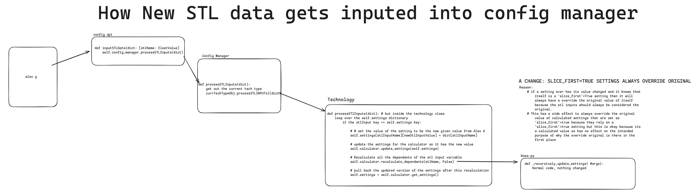

(ConfigAPI)=
# Config API
- This class allows for communication between the [Estimator](#Estimator) tab and the [Config Manger](#ConfigManager) through various functions listed below

## Purpose/Motivation

- What problem does this solve?
	- This class was developed to make it easier for the Estimator tab to get the information it needs without needing to know the inner workings of the [config manager](#ConfigManager) 
	- Having this class also allows us to determine if we want to emit a signal when the [Estimator](#Estimator) recoveries or updates a value like in one of the functions below

- When would someone use this?
	- They would use it for example when the [Estimator](#Estimator) slices the part and gets its STL values, the Estimator will send over those values to the [config manager](#ConfigManager) so it can update all of its settings that depend on (The low level function that does this is [here](#TechnologyProcessSTL))

## Basic Usage Example

- A simple, realistic code snippet showing the most common way to use it (keep it short, just enough for the basic idea)

{lineno-start=0 emphasize-lines="7,8,9,10,11,12"}
```python
# CostEstimator/estimate/estimate_manager.py
def _update_config(self) -> None:
	"""
	...truncated for example...
	"""
	try:
		surfaceArea = self.solid_part.surfaceArea  # available even for non-watertight parts
		stl_settings = {
			'resin_volume_used_to_print_one_mold': surfaceArea * 8.0,
			'net_part_volume': self.partVolume * 1.5,
			'dlp_build_time': self.totalTime / 60.0,
		}
		self._config_api.input_STL_data(self.technology.type, stl_settings)
	except Exception as e:
		msg = f"Error updating config manager: {str(e)}"
		Logger.logException('e', msg)
		raise
```
This example shows that inside the [Estimator](#Estimator) after getting the specific STL values it will package them up into a dictionary and send them over to the config api to get updated in the config manager.  

## Key Methods/Functions
```{eval-rst}
.. py:method:: get_available_technologies_list(self) -> List[str]

   This returns a list of all available technologies. This list is derived from the supporeted technologies in the file service.
   This will pull the names from the json metadata under "Type". 

   :return: A list of strings that are names for the available technologies under each json metadata
   :rtype: List[str]
   
.. py:method:: get_technology(self, technology_name: str) -> Technology
   
   This returns the :ref:`Technology Object <TechnologyModel>` for the given technology name.
   
   :param str technology_name: The name of the technology requested, I belive it should match the one found in the metadata of the json files 
   :return: A technology object for the corrisponding name
   :rtype: Technology
```


## Important Attributes/Properties


- What can the user access or modify?

  

## Examples Section
- More detailed usage examples (Show the common patterns)

## Notes/Warnings

- Edge cases, performance considerations, gotchas, commit mistakes people can make 

