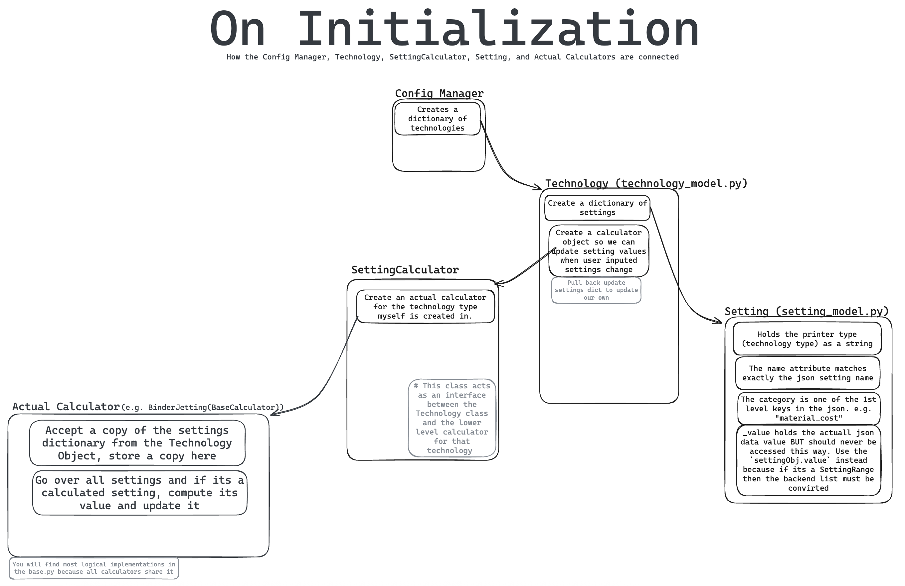

(ConfigManager)=
# ConfigManager
- **CostEstimator/config/config_manager.py**
- This class manages the connection between PyQt6 GUI objects seen in the plugin within the configuration page and the internal data structures (e.g. [Technology Model](#TechnologyModel))

## Inherits
[QObject](https://www.riverbankcomputing.com/static/Docs/PyQt6/api/qtcore/qobject.html#QObject)
- Utilizes PyQt6 framework to create signals and slots that are used in connection to the GUI items

## Purpose/Motivation

- What problem does this solve?
  - The problem this solves is the creation of a GUI for the plugin that allows users to edit data relating to the estimation process.
	- This creates the configuration window GUI in which users can configure relevant data for each respective printing technology type which will be used in the estimation process.

- When would someone use this?
	- This class is only used once within the main [CostEstimator](#CostEstimator) where it is linked to Cura and ready to be utilized by users using the plugin.

## Basic Usage Example

- This is an example of how a developer would add the [ConfigManager](#ConfigManager) to Cura and link the relevant QML Component (TODO: Link Relevant QML Component)

```python
...
self._config_window_qml = os.path.join(
  os.path.dirname(os.path.abspath(__file__)),
  "config",
  "resources",
  "qml",
  "PrinterConfigWindow.qml"
)
self._config_manager = ConfigManager()
# Requires Path to QML File and QObject
self._config_window = self._application.createQmlComponent(
  self._config_window_qml,
  {"configManager": self._config_manager}
)
...
```


## Key Methods/Functions

The functions utilized are mostly QML Slots that are triggered by GUI elements. Whenever something utilizes the `@pyqtSlot` decorator, it is most likely only ever used within the relevant QML for the config window.

### \_\_Init\_\_() Method
We first create the [FileService](#FileService) object and send it the `CostEstimator/config/resources/data` folder.
Then the [Schema Validator](#SchemaValidator) and [ConfigAPI](#ConfigAPI) is created.
Then we validate the [Json Definition](#JsonDefinition) files, and followed by the [Json Default](#JsonDefaults) files.
Then if there are user files we will validate their files, but if they fail we simply log. 

Then we pull the entire [Json Definition](#JsonDefinitions) file and [Json Default](#JsonDefaults) and store it in `self._data_schema` and `self._default_data`. Just so you are aware, these variables are dictionaries with keys being the names of each technology found in its [Jsons metadata](#Metadata), and the values are the *entire* json file for that technology. 

Then we build the dictionary of technologies. This dictionary stores the name of each technology (again the one in the json metadata), and its [technology object](#TechnologyModel) as the value.

Then we store the string of current technology type (name) we first seen in the technologies dictionary we just made. 

Then we initializing the mapping of the current stl data state for each technology. Storing false for each because it will be true once the user presses calculate. This is used to keep track of what to set the yellow "modified" label to visible or not when switching between technologies. See issue [#136](https://github.com/cstoner-arizona/CostEstimator/pull/136)

### Functions

```{eval-rst}
.. py:function:: create_technology_models(data_dict: Dict[str, dict], schema_dict: Dict[str, dict])

   *Decorated with* ``@staticmethod``

   Creates :ref:`TechnologyModel` instances for each technology type using provided data and schema dictionaries.

   :param Dict[str, dict] data_dict: Dictionary mapping technology types to their data. 
   :param Dict[str, dict] schema_dict: Dictionary mapping technology types to their schemas.
   :return: Dictionary of technology type to Technology instance, or None if no models created.
   :rtype: Dict[str, Technology] or None
   :raises ValueError: If data_dict or schema_dict is empty, or if a technology type in data_dict is not present in schema_dict.
   :raises TypeError: If data_dict or schema_dict are not a dictionary, or if an invalid technology type is encountered.
```

### Methods
```{eval-rst}
.. py:method:: check_tech_type(tech_type: str)

	This method will check if the tech_type string name given is in the dictionary of technologies as a key. If its not it will raise a TechTypeNotFound() exception. 
	
	:param str tech_type: The name of a technology. It should be pulled from the :ref:`json metadata<Metadata>`
	:Raises TechTypeNotFound: If the tech_type given is not in self.technologies.keys()


.. py:method:: process_STL_inputs(new_stl_input_data: dict[str, float])

   Processes STL input data by forwarding it to the currently selected technology.

   Called from ``Config_api.py`` after the estimator passes sliced STL file data
   into ``config_api.inputSTLData()``. The data is then forwarded to the currently
   selected technology to update its relevant settings.

   .. note::
      This function assumes the dictionary given has the proper types for all keys and values.

   :param dict[str, float] new_stl_input_data: STL setting names as keys and their
       corresponding sliced float values.
   :return: None


.. py:method:: switchCurrentTypeDuringSTLInput(new_tech_type: str)

	This function is called in the :ref:`ConfigAPI` if the :ref:`Estimator` is sending STL data for a technology that is not currently the selected technology of the config manager. This will be called to change the current technology to the one needing to be updated. 
	Think about it like this
	Estimator --send STL data--> ConfigAPI 
	
	ConfigAPI detects ConfigManager type differs from incoming STL data
	
	ConfigAPI --> calls this function --> switchTypeDuringSTLInput()
	
	ConfigAPI continues updating stl data.

	ConfigAPI --> calls this function --> switch back to original tech
	
	:param str new_tech_type: A assumed valid tech type name that we will switch to 
	:raise: ValueError if the new_tech_type is not a valid type name
	


	

.. py:method:: reset_all_technologies_stl_states()

	This method is called when the user loads the plugin from the drop down in the Cura plugins. This method will reset the STL state of all technologies to be 'not valid stl data' so it will show "Press Calculate to see"
	
	

```

### QML Slots

Contains both getters and setters which are triggered from the QML component.
Getters will get data from various data structures (mostly [Technology](#TechnologyModel)) in order to populate the QML with information such as printer technology types that are selectable, the categories (e.g. "machine_cost", "material_cost") of data within each technology, and the individual parameter values with their names.
Setters will set data from a QML based input such as the dropdown box for selectable materials (e.g. "In718", "FDM:PLA") and individual parameter values.

:::{note}
:name: qml-slot-annotations
QML Slots require their own decorator/annotation in order to be used by QML. This reference will detail both the `@pyqtSlot` and the function definition.
:::

:::{seealso}
:name: seealso-qvariant
:class: dropdown
The type `QVariant` is used within the `@pyqtSlot` decorator syntax as a way to unionize Python logic with C++ objects that PyQt6 is built off of. For example, a `list` object in Python needs to be translated to an `array` within C++ and a `QVariant` is used to account for this different. (Note that usage in `@pyqtSlot` must surround `QVariant` with `'`). See PyQt6 [`QVariant`](https://www.riverbankcomputing.com/static/Docs/PyQt6/api/qtcore/qvariant.html#QVariant) for further information.
:::


#### Functional Slots

```{eval-rst}
.. py:method:: saveSettings(tech_type: str)

   *Decorated with* ``@pyqtSlot(str, result=int)``

   This will save settings for a specific technology type once the user presses "Save Changes". It saves it out to the user json. The SaveLoadHandler will ask the user for the save location down the line.

   :param str tech_type: Printing technology name as a string
   :return: The status of the save, Success, Failure, Cancelled.
   :rtype: int


.. py:method:: loadSettings(tech_type: str)

   *Decorated with* ``@pyqtSlot(str, result=int)``

   Within the SaveLoadHandler it will ask the user to pick a filename to load, it loads it, then returns the loaded_technoogy as a Technology object. Then this function puts that object in the dictionary of technologies. 

   :param str tech_type: Printing technology name as a string
   :return: The status of the load, Success, Failure, Cancelled.
   :rtype: int
   
   
   
.. py:method:: discardChanges(tech_type)

   *Decorated with* ``@pyqtSlot(str, result=bool)``
   :param str tech_type: Printing technology name as a string
   
   This method will tell the technology object to `.revert_all_settings()` to their originals. Then this method emits :ref:`modifiedChanged <modifiedChangedSignal>` and :ref:`settingsDataDiscarded <settingsDataDiscardedSignal>`.
   
   :return: True if the settings were successfuly reverted to originals. False otherwise
   :rtype: Boolean
   
   
   
   
.. py:method:: discardAllChanges()

   *Decorated with* ``@pyqtSlot(result=bool)``
   
   This method will tell the EVERY technology object to `.revert_all_settings()` to their originals. Then this method emits :ref:`modifiedChanged <modifiedChangedSignal>` and :ref:`settingsDataDiscarded <settingsDataDiscardedSignal>`.
   
   :return: True if ALL of the settings were successfuly reverted to originals. False otherwise
   :rtype: Boolean
   
   
   
   
.. py:method:: refreshSettings()

   *Decorated with* ``@pyqtSlot()``
   
   This method does only 1 thing. This method will emit :ref:`updateSetting signal <updateSettingSignal>`. 


.. py:method:: title(text)

	*Decorated with* ``@pyqtSlot(str, result='QVariant')``
	:param str text: The input text to convert
	
	This method will be given a string that is expected to have underscores and lowercase and convert the underscores to spaces and turn the text title case.
	
	:return: text.replace('_', ' ').title()
	:rtype: str
	
	
	
	
	
.. py:method:: anyTechnologyIsModifed()

	*Decorated with* ``@pyqtSlot(result=bool)``
	
	This method will compute if any technologies are currently modified, and if so it returns True. If all are unmodified it returns False. This method will be called when the user tries to leave the plugin to determine if we should prompt them to discard all changes or not.
	
	:return: True if at least 1 technology IS modified, False if all unmodified. 
	:rtype: Boolean
	
	
	
	
	

.. py:method trigger_modifiedChanged()

	*Decorated with* ``@pyqtSlot()``
	This method will emit the :ref:`modifiedChanged Signal <modifiedChangedSignal>`. This method only does 1 thing. 
	This method is called whenever a user selects a different technology because the `config_manager.modified` pyqtProperty will get sent out to its dependents (i.e. Yellow "Modified" gui label) once the :ref:`modifiedChanged signal<modifiedChangedSignal>` is emited. Its kind of a weird loophole. QML onClick -> PythonSlot -> Emit Signal -> QT Property recomputed -> QML Dependent gets updated data.
   
   
   

   
```

#### Getters

```{py:method} getAllCategories(tech_type: str)

*Decorated with* `@pyqtSlot(str, result='QVariant')`

Returns a `list[str]` which are category names given a valid printing technology as a string (see [hint](#hint-json-string-names) to find string names). Example of this list `["configuration","slicing_configuration","material_cost","machine_cost",...`.

```

```{py:method} getCategorySettingNames(tech_type: str, category: str)
*Decorated with* `@pyqtSlot(str, str, result='QVariant')`

Returns names of all settings in a specific category given the valid printing technology name as a string and a valid category name contained in the technology as a string.
```

```{eval-rst}
.. py:function:: getSettingType(tech_type: str, setting_name: str)

   *Decorated with* ``@pyqtSlot(str, str, result=str)``

   Returns a setting's type as a string given the valid printing technology name as a string and a valid setting name contained in the technology as a string.
   If no matching technology or setting name is found, then returns an empty string `""`.

   :param str tech_type: Printing technology name as a string
   :param str setting_name: Name of the setting contained in the printer technology as a string
   :return: The setting's type as a string. Will be same as defined in :ref:`hint-json-string-names`.
   :rtype: str


.. py:method:: getSettingEditableStatus(tech_type: str, setting_name: str)

   *Decorated with* ``@pyqtSlot(str, str, result=bool)``

   This will check if a specific setting for a given tech type is user-editable (user defined).
   This is used to determine if they box in the config manager GUI should be editable. 

   :param str tech_type: Printing technology name as a string
   :param str setting_name: The name of the setting we want to check
   :return: True if the setting is user defined, false if not (calculated, stl, buildtime)
   :rtype: Boolean


.. py:method:: getSettingDescription(tech_type: str, setting_name: str)

   *Decorated with* ``@pyqtSlot(str, str, result=str)``

   Get the description of a specific setting for a given printing type.

   :param str tech_type: Printing technology name as a string
   :param str setting_name: The name of the setting we want to check
   :return: The string description stored in the 
   :rtype: Str


.. py:method:: getSettingValue(tech_type: str, setting_name: str)

   *Decorated with* ``@pyqtSlot(str, str, result='QVariant')``

   Get the value of a specific setting within a technology.

   :param str tech_type: Printing technology name as a string
   :param str setting_name: The name of the setting we want to check
   :return: The value of the setting as a QVariant. Could be Int, Float, List for ranges, or String for config settings. 
   :rtype: QVariant


.. py:method:: getSettingUnits(tech_type: str, setting_name: str)

   *Decorated with* ``@pyqtSlot(str, str, result=str)``

   Get the json defined units of a specific setting within a technology.

   :param str tech_type: Printing technology name as a string
   :param str setting_name: The name of the setting we want to check
   :return: math units of the setting. (e.g. "kg" "$" "kW/hr")
   :rtype: String


.. py:method:: getSettingDecimalPlaces(tech_type: str, setting_name: str)

   *Decorated with* ``@pyqtSlot(str, str, result=int)``

   Get the number of decimal places defined within the json for a specific setting.

   :param str tech_type: Printing technology name as a string
   :param str setting_name: The name of the setting we want to check
   :return: The number of decimal places for the requested setting, or 0 if not found
   :rtype: int


.. py:method:: getSettingMinimum(tech_type: str, setting_name: str)

   *Decorated with* ``@pyqtSlot(str, str, result='QVariant')``

   Get the minimum value for a specific setting for a given printing type.

   :param str tech_type: The type of tech to query.
   :param str setting_name: The name of the setting to retrieve the minimum value for.
   :return: The minimum value of the requested setting, or 0 if not found.
   :rtype: int | float


.. py:method:: getSettingMaximum(tech_type: str, setting_name: str)

   *Decorated with* ``@pyqtSlot(str, str, result='QVariant')``

   Get the maximum value for a specific setting for a given printing type.

   :param str tech_type: The type of tech to query.
   :param str setting_name: The name of the setting to retrieve the maximum value for.
   :return: The maximum value of the requested setting, or 0 if not found.
   :rtype: int | float


.. py:method:: getSettingDropdownOptions(tech_type, setting_name)

	:param str tech_type: The type of tech to query 
	:param str setting_name: The name of the setting to retrieve dropdown options for.
	
	This function is not used because there are not settings that are drop downs.

	:return: The dropdown options for the resquested setting, or an impty list if not found. 
	:rtype: List


.. py:method:: getSettingSTLState(tech_type: str, setting_name: str)

   *Decorated with* ``@pyqtSlot(str, str, result=bool)``

   This function will help the GUI determine if it should show "Press calculate to see" or not based on if the tech_type given has up to date stl data based on wether the plugin was just opened. Once the user presses Calculate then the stl data will appear. 

   :param str tech_type: Printing technology name as a string
   :param str setting_name: The name of the setting we want to check
   :return: True if the setting name given is a STL based setting AND the technology given has received up to date STL data from the estimator tab. False if not a STL setting, False if not up to date STL data.
   :rtype: Boolean


.. py:method:: getTechnologyMaterialTypes(tech_type: str)

   *Decorated with* ``@pyqtSlot(str, result='QVariant')``

   Returns a list of the material types (material groups) for the technology. For example DLP has "resin" and "metal" so it will return those in a list.

   :param str tech_type: Printing technology name as a string
   :return: A list of the material types (material groups) for that technology. e.g. ["metal","resin"]
   :rtype: QVariant
   
   
   
   
.. py:method:: getMaterialSelection(tech_type, material_type)

	:param str tech_type: The tech type that we want to pull the sub materials from
	:param str material_type: The name of the group of materials we want to pull from (e.g. 'metal'). These categories are the keys in compatible materials in :ref:`Metadata` values.
	
	This function will return a Title case version of the sub material names within a material group. These will be used to populate the material selection drop downs in the GUI.
	
	:return: A list of title case strings pulled from the list of specific material names within the :ref:`json <JsonFilesInfo>` :ref:`Metadata`
	:rtype: List
	


.. py:method:: determineCurrentMaterialIndex(tech_type_name, material_type)

	:param stl tech_type_name: The name of the technology. its the json metadata name
	:param str material_type: The name of the material GROUP. (e.g. 'Metals', 'Slurry')
	
	This function will be called when the user selects another technology in the gui. This function determines which material from the material group is currently being displayed by the settings in the technology. Then to be able to change the current material in the material selector GUI this fucntion will return the index that the gui has to set that dropdown index to. The docstring in the source code gives more in depth example. 
	
	:return: Index that maps to the material in the GUI material drop down for the given material group
	:rtype: int
	
	
	
	
	


```

#### Setters 
```{eval-rst}
.. py:method:: setSettingValue(tech_type, value, range_type)

	:param str tech_type: String that represent the type of tech to query. Must be a valid name
	:param str setting_name: The name of the setting that will be altered
	:param str value: The value that is overwriting a given setting value, given as a string, converted to correct type later. 
	:param str range_type: Optional setting. It is to specify the types for the min and max of the range if the new value is a range
	
	*Decorated with* ``@pyqtSlot(str, str, str, result=bool)`` and ``@pyqtSlot(str, str, str, str, result=bool)``
	
	This set the specific setting value for a given technology.
	It will emit the :ref:`modifiedChanged <modifiedChangedSignal>`, and :ref:`updateSetting <updateSettingSignal>` signals 
	
	:return: It returns True if the value was successfully set, False otherwise
	:rtype: boolean
	
	

.. py:method:: setMaterialSelection(tech_type, material_type, material_name)

	:param str tech_type: Technology type that is being selected for material change
	:param str material_type: The type of material being changed (e.g., "filament", "resin").
	:param str material_name: The name of the material to select (e.g., "alsi10mg", "316_l_stainless_steel").
	
	This function will change all material dependent settings within the technology to the material name given. Notice we do not need the `material_type` (material group), we only pass it for logging. This will emit the :ref:`modifiedChanged Signal <modifiedChangedSignal>` and :ref:`updateSetting Signal<updateSettingSignal>`. Then this method returns True if the change was successful and False if not.
	
	:return: True if the material change was successful, False if not
	:rtype: Boolean
	
	
	
	

```

:::{hint}
:name: hint-json-string-names
The string names discussed in the functions above can be found in the JSON definitions. See [JSON Definitions](#JsonDefinitions) for more details.
:::

## Important Attributes/Properties

{#ConfigManagerCurrentType}
```{eval-rst}
.. py:property:: file_service
   :type: :ref:`FileService`
   
   
.. py:property:: current_type
	:type: String
	
	Holds the name of the currently selected technology in the GUI. This "name" is the same string as found in that technologies :ref:`json metadata <Metadata>`.
	

.. py:property:: schema_validator
	:type: :ref:`SchemaValidator`
	
	
.. py:property:: api
	:type: :ref:`ConfigAPI`
	
	
.. py:property:: _data_schema
	:type: Dict[tech_name, Dict[category_name, Dict[setting_name, Dict[type,user_defined,material_depenent, etc]]]]
	
	Holds a dictionary with the keys being the tech name found in the :ref:`Metadata` and the values being the entire :ref:`defintion json<JsonDefinition>`
	
	
.. py:property:: _default_data
	:type: Dict[tech_name, Dict[category_name, Dict[setting_name, (list | int | float)]]]
	
	Holds a dictionary with the keys being the tech name found in the :ref:`Metadata` and the values being the entire :ref:`default json<JsonDefault>`
	
.. py:property:: _user_data
	:type: Dictionary
	
	This property is not used as of July 2026. Its a part of a future feature where we load user saved json 
	
```

### QML Signals

{#updateSettingSignal}
**updateSetting Signal**: 

{#modifiedChangedSignal}
**modifedChanged Signal**: 

{#currentTypeChangedSignal}
**currentTypeChanged Signal**:

{#settingsDataDiscardedSignal}
**settingsDataDiscarded Signal**:


### QML Properties
*Note*: These properties are PyQt properties. This means that they are called in QML with the format `configManagerObj.propertyname`.
These properties have a really nice trait where we can add a `notify=mySignalNameHere` within their pyqtProperty decorator so that anytime that `mySignalNameHere` signal is emitted, this property will be "called" and will send out its result to every QML bound attribute that depends on it. 

```{eval-rst}
.. py:property:: types
	:type: list
	
	*Decorated with* ``@pyqtProperty(list, notify=settingsDataDiscarded)``
	
	
.. py:property:: modified
	:type: Boolean
	
	This will return True if the `self.current_type` of technology is currently modified
	
.. py:property:: currentType
	:type: Str
	
	Returns the currently selected technology type in the GUI.
	`self.currentType` also has a getter which will emit :ref:`currentTypeChanged Signal <currentTypeChangedSignal>` and :ref:`settingsDataDiscarded Signal <settingsDataDiscardedSignal>`
	

```
- What can the user access or modify?

  

## Examples Section
- More detailed usage examples (Show the common patterns)

## Notes/Warnings

- Edge cases, performance considerations, gotchas, commit mistakes people can make 

